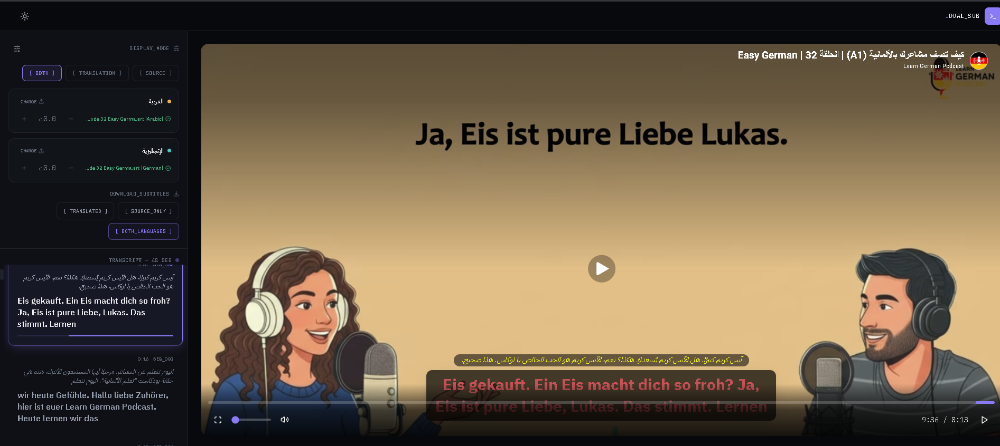

# 🎬 YouTube Dual Subtitles

![YouTube Dual Subtitles ]


A fully client‑side web app for watching any YouTube video with **two synchronized subtitle tracks** in different languages, presented as a console‑style dashboard: video on one side, a live synced transcript panel on the other.

No backend. No database. No API keys. Everything runs in the browser.

<p align="center">
  
  
  
  
  
  
</p>

## ✨ Features

### 🎨 Console‑Style Dashboard

- Near‑black background with electric violet accents for all system chrome
- Distinct gold / teal colour identity for subtitle track A vs track B
- Dark / light theme with automatic system preference detection and manual toggle
- Live transcript panel auto‑scrolls to keep the current segment centred

### 🌐 Dual Subtitle Power

- Upload **any two independent SRT/VTT files** (different sources, different segmentations)
- Frame‑accurate sync using `O(log n)` binary‑search cue lookup
- Per‑track manual sync offset (±15s) to correct mistimed files
- Toggle overlay view: source only, translation only, or both side‑by‑side
- Export subtitles as SRT – source only, translation only, or merged bilingual file

### 🚀 Technical Highlights

- **Type Safety**: Full TypeScript codebase, strict null checks, shared types across parsing, sync, and UI
- **Isolated Re‑renders**: Video time is exposed as an imperative getter, only subscriber components update on tick
- **Performance**: Memoised transcript cards, binary‑search cue matching, 2 MB file size cap
- **Security**: XSS‑safe by construction, no `dangerouslySetInnerHTML`, strict URL validation, `youtube-nocookie.com`
- **Testing**: Automated regression tests (Vitest + Testing Library) that reproduce past crash scenarios

## 🏗️ Project Structure

```
├── 📁 public
├── 📁 src
│   ├── 📁 __tests__
│   │   ├── 📄 full-workflow.test.tsx
│   │   ├── 📄 matchmedia-crash.test.tsx
│   │   ├── 📄 repro.test.tsx
│   │   └── 📄 setup.ts
│   ├── 📁 components
│   │   ├── 📁 console
│   │   │   ├── 📄 ConsolePanel.tsx
│   │   │   ├── 📄 DownloadSubtitles.tsx
│   │   │   ├── 📄 SliceCard.tsx
│   │   │   ├── 📄 SourceFileRow.tsx
│   │   │   ├── 📄 TranscriptList.tsx
│   │   │   └── 📄 ViewModeToggle.tsx
│   │   ├── 📁 layout
│   │   │   ├── 📄 AppShell.tsx
│   │   │   ├── 📄 Footer.tsx
│   │   │   └── 📄 Header.tsx
│   │   ├── 📁 settings
│   │   │   ├── 📄 FontSizeControl.tsx
│   │   │   ├── 📄 SettingsPanel.tsx
│   │   │   └── 📄 ThemeToggle.tsx
│   │   ├── 📁 subtitles
│   │   │   └── 📄 SyncOffsetControl.tsx
│   │   ├── 📁 system
│   │   │   └── 📄 ErrorBoundary.tsx
│   │   ├── 📁 ui
│   │   │   ├── 📄 Button.tsx
│   │   │   ├── 📄 Card.tsx
│   │   │   ├── 📄 ColorPicker.tsx
│   │   │   ├── 📄 IconButton.tsx
│   │   │   ├── 📄 Select.tsx
│   │   │   └── 📄 Slider.tsx
│   │   └── 📁 video
│   │       ├── 📄 SubtitleOverlay.tsx
│   │       ├── 📄 VideoControlBar.tsx
│   │       ├── 📄 VideoStage.tsx
│   │       ├── 📄 VideoTopBar.tsx
│   │       ├── 📄 VideoUrlForm.tsx
│   │       └── 📄 YouTubePlayerView.tsx
│   ├── 📁 constants
│   │   ├── 📄 languages.ts
│   │   └── 📄 theme.constants.ts
│   ├── 📁 context
│   │   ├── 📄 SubtitleSettingsContext.tsx
│   │   └── 📄 ThemeContext.tsx
│   ├── 📁 hooks
│   │   ├── 📄 useActiveCue.ts
│   │   ├── 📄 useFullscreen.ts
│   │   ├── 📄 useLocalStorage.ts
│   │   ├── 📄 usePlayerTime.ts
│   │   ├── 📄 useSubtitleTrack.ts
│   │   ├── 📄 useTheme.ts
│   │   └── 📄 useYouTubePlayer.ts
│   ├── 📁 lib
│   │   ├── 📁 subtitles
│   │   │   ├── 📄 findActiveCue.ts
│   │   │   ├── 📄 pairCues.ts
│   │   │   ├── 📄 parseSRT.ts
│   │   │   ├── 📄 parseSubtitleFile.ts
│   │   │   ├── 📄 parseVTT.ts
│   │   │   └── 📄 serializeSRT.ts
│   │   ├── 📁 utils
│   │   │   ├── 📄 cn.ts
│   │   │   └── 📄 sanitize.ts
│   │   └── 📁 youtube
│   │       ├── 📄 extractVideoId.ts
│   │       └── 📄 loadYouTubeIframeAPI.ts
│   ├── 📁 styles
│   │   └── 🎨 tokens.css
│   ├── 📁 types
│   │   ├── 📄 subtitle.types.ts
│   │   ├── 📄 theme.types.ts
│   │   └── 📄 youtube.types.ts
│   ├── 📄 App.tsx
│   ├── 🎨 index.css
│   ├── 📄 main.tsx
│   └── 📄 vite-env.d.ts
├── ⚙️ .eslintrc.json
├── ⚙️ .gitignore
├── 📝 README.md
├── 🌐 index.html
├── ⚙️ package-lock.json
├── ⚙️ package.json
├── 📄 postcss.config.js
├── 📄 tailwind.config.ts
├── ⚙️ tsconfig.app.json
├── ⚙️ tsconfig.json
├── ⚙️ tsconfig.node.json
├── 📄 vite.config.ts
└── 📄 vitest.config.ts
```

---
---

## Getting Started

```bash
npm install
npm run dev       # http://localhost:5173
npm run build     # production build → dist/ (fully static)
npm run lint      # code quality check
```

---

## Security

- No API keys or secrets anywhere — the IFrame Player API requires none.
- Subtitle files are capped at 2MB and validated by extension before parsing.
- Playback runs through `youtube-nocookie.com`.
- All rendering goes through React's safe text-node escaping — no raw HTML injection path exists for user-supplied content.

---
---

## 📝License

- This project is licensed under the MIT License - see the LICENSE file for -details

---

---

## 👏 Acknowledgments

- DummyJSON for the free product API
- Unsplash for beautiful category images
- Tailwind CSS for the amazing utility framework
- React Community for excellent documentation

---
