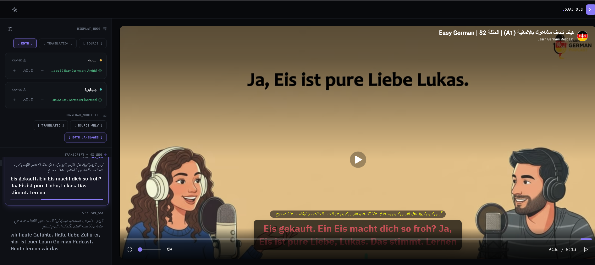

# 🎬 YouTube Dual Subtitles

<!-- Add a real screenshot at ./public/screenshot.png -->


A fully client‑side web app for watching any YouTube video with **two synchronized subtitle tracks** in different languages, presented as a console‑style dashboard: video on one side, a live synced transcript panel on the other.

No backend. No database. No API keys. Everything runs in the browser.

<p align="center">
  
  
  
  
  
  
  
</p>

## ✨ Features

### 🎨 Console‑Style Dashboard

- Near‑black background with electric violet accents for all system chrome
- Distinct gold / teal colour identity for subtitle track A vs track B
- Dark / light theme with automatic system preference detection and manual toggle
- **Resizable sidebar** — hover the divider between video and transcript to reveal a drag handle (mouse or keyboard), width persists across sessions
- **Sidebar side swap** — a dedicated toggle instantly moves the sidebar between the left and right of the video, correctly on any text direction; the choice persists across sessions
- **Collapsible upload panel** — auto‑collapses once both subtitle files are ready, freeing up space for the transcript
- Fully responsive: fixed‑height dashboard with independent scroll regions on desktop, and a mobile layout where the video stays pinned (`sticky`) at the top with a compact, non‑scrolling "now playing" caption strip underneath it
- Mobile‑tuned controls: comfortable touch‑sized buttons throughout, an always‑visible (not hover‑only) seek handle, the volume slider gives way to a simple mute toggle on narrow screens to avoid crowding the control bar, and text inputs are sized to avoid iOS Safari's auto‑zoom‑on‑focus
- Full RTL/LTR support with automatic per‑line text direction detection

### 🎬 Two Ways to Watch

- **YouTube URL** — paste any link, works exactly as before
- **Local video file** — upload a file straight from your device (MP4, WebM, MOV, MKV...); it never leaves the browser (played via a local Object URL, nothing is uploaded to any server)
- Both paths lead to the *exact same* viewing experience — same custom control bar, same keyboard shortcuts, same dual‑subtitle overlay and transcript panel. A single unified player interface (`useVideoPlayer`) sits in front of both, so no other part of the app needs to know or care which one is active

### 📼 Watch History

- A "continue watching" list appears above the URL/file form, showing every recently‑watched video with its title (fetched from YouTube's own `getVideoData()`), thumbnail, and a relative timestamp (`Intl.RelativeTimeFormat`, no library)
- **YouTube entries resume with a single click** — the exact same URL is resubmitted automatically, and playback resumes from the saved position
- **Local video entries cannot auto‑resume** — browsers fundamentally do not allow a site to reopen a file from disk without the user selecting it again, so clicking a local entry instead switches straight to the "local file" tab and shows a clear reminder of the exact file name to pick, rather than pretending to do something it structurally cannot
- **Subtitle files are activated automatically** — their full text content (not just the file name) is saved to `IndexedDB` on upload, keyed by (video, track, file name). Revisiting the same video from history re‑parses that stored content through the exact same upload pipeline with zero manual steps — no re‑upload, no reminder. If the content isn't available (older browser, private‑browsing restrictions, or a file uploaded before this feature existed), the UI falls back to a clear reminder ("أعد رفع: ar.srt") instead of pretending nothing changed
- Per‑entry removal and a "clear all" action — both fully clean up *everything* tied to that video (saved playback position, sync offset, and subtitle content in `IndexedDB`), not just the visible history row; capped at 40 entries (oldest pruned automatically)
- No backend, no accounts — entry metadata lives in `localStorage` like the rest of the app's persistence; subtitle file *content* lives in `IndexedDB` (larger quota, built for this size), capped at the 30 most‑recently‑saved files

### 🌐 Dual Subtitle Power

- Upload **any two independent SRT/VTT files** (different sources, different segmentations)
- **Upload a single bilingual SRT/VTT file** — each cue containing both languages (typically one line per language) is automatically split into the two tracks by detecting each line's writing direction (RTL → source, LTR → translation), with a positional fallback for same‑direction language pairs; both tracks appear with the exact same design as if two separate files were uploaded
- Frame‑accurate sync using `O(log n)` binary‑search cue lookup
- Per‑track manual sync offset (±15s) to correct mistimed files — baked directly into the transcript highlight, so it never drifts from what's burned into the video overlay. The offset is remembered per (video, subtitle file) pair and restored automatically next time you open the same combination
- Live transcript panel with the active segment highlighted in real time, including an animated progress bar tracking position within that exact segment
- **Search the transcript** — filters both source and translation text live as you type (press `/` to jump straight to the search field), click any result to seek the video there instantly. Segment numbers keep their original position (`SEG_047` stays `SEG_047` even filtered down to one result), and the active‑segment auto‑scroll pauses while searching so it doesn't yank a manually‑browsed result list back to the live position every few seconds
- **Draggable burned‑in captions** — drag the subtitle bubble anywhere within the video frame (e.g. to avoid covering on‑screen text), constrained to the video's own bounds; double‑click to reset, position persists across sessions
- Toggle view mode: source only, translation only, or both side‑by‑side
- Export subtitles as SRT — source only, translation only, or merged bilingual file

### ⌨️ Playback & Keyboard Shortcuts

- `Space` — play / pause
- `C` — speed up by 0.5× (up to 2×) · `X` — slow down by 0.5× (down to 0.25×) · `Z` — reset to 1×
- `F` — toggle fullscreen
- `←` / `→` — jump to the previous / next subtitle scene
- `↑` / `↓` — volume up / down
- `0` — restart the current scene from its beginning (play once, no loop)
- `1` — repeat the current scene **twice** · `2` — **three** times · `3` — **four** times (a persistent on‑screen badge tracks loop progress, e.g. `2/3`)
- `?` — open the in‑app **keyboard shortcuts help panel** (also reachable via a button in the console header) — lists every shortcut above, grouped into categories (Playback / Navigation & Repeat / General) instead of one long flat list
- `/` — focus the transcript search field
- All shortcuts work identically whether watching a YouTube video or a local file
- All shortcuts are automatically disabled while typing in any text field, and ignore modifier‑key combos (`Ctrl`/`Cmd`/`Alt`) so they never fight with browser shortcuts
- **Focus retention**: clicking the YouTube video moves keyboard focus into its cross‑origin iframe, whose keydown events never reach the parent document. A `focusin` listener on `document` detects the instant focus lands on the iframe and reclaims it for the stage container immediately, so shortcuts keep responding reliably — the keydown listener is also registered in the capture phase as a defensive measure
- Every shortcut has an on‑screen flash indicator (à la YouTube/Netflix) confirming the action, plus a clickable equivalent in the control bar (a speed menu) for mouse/touch users
- **Not included: a YouTube resolution/quality picker.** YouTube [officially discontinued](https://developers.google.com/youtube/iframe_api_reference) programmatic quality control for embeds — `setPlaybackQuality` and the `vq` load‑time hint are both documented no‑ops today, so a quality selector for YouTube videos here would just be a fake control that does nothing. Quality is fully automatic (adaptive bitrate) on YouTube's side. This doesn't apply to local file uploads, which always play at their native, unmodified quality.

### 🚀 Technical Highlights

- **Type Safety**: Full TypeScript codebase, strict null checks, shared types across parsing, sync, and UI
- **Player adapter pattern**: `useYouTubePlayer` and `useLocalVideoPlayer` independently implement the same control‑surface shape; `useVideoPlayer` composes them behind one interface, so `VideoControlBar`, `SubtitleOverlay`, and the keyboard shortcuts hook are entirely source‑agnostic
- **Isolated Re‑renders**: Video time is exposed as an imperative getter via `useSyncExternalStore`; only subscriber components update on tick, and transcript cards are memoized so only the active one re‑renders during playback
- **`overflow-x: clip`, not `hidden`**: the global horizontal‑overflow safety net in `index.css` deliberately uses `clip` — `hidden` on `html`/`body` is a well‑known way to silently break `position: sticky` on descendants (it creates a new scroll/formatting context), which would have broken the mobile sticky video. `clip` gets the same "no horizontal scrollbar" result without that side effect.
- **Resilient by design**: every external browser/YouTube/media API call (`matchMedia`, `scrollIntoView`, the Fullscreen API, `HTMLMediaElement.play()`, and the entire YouTube postMessage bridge) is wrapped defensively — a temporary hiccup degrades gracefully instead of crashing the app
- **Performance**: binary‑search cue matching, 2 MB subtitle file size cap, code‑split settings panel
- **Security**: XSS‑safe by construction, no `dangerouslySetInnerHTML`, strict URL validation, `youtube-nocookie.com`; local video files are validated by MIME type/extension and never transmitted anywhere
- **Testing**: automated regression tests (Vitest + Testing Library) that reproduce real past crash scenarios before asserting the fix

---

## 🏗️ Project Structure

```
├── 📁 public
├── 📁 src
│   ├── 📁 __tests__
│   │   ├── 📁 testHelpers
│   │   │   ├── 📄 mockYouTubePlayer.ts
│   │   │   └── 📄 resetIndexedDb.ts
│   │   ├── 📄 bilingual-upload.test.tsx
│   │   ├── 📄 collapsible-upload-section.test.tsx
│   │   ├── 📄 draggable-subtitle-overlay.test.tsx
│   │   ├── 📄 dynamic-accent-color.test.tsx
│   │   ├── 📄 flaky-player-bridge.test.tsx
│   │   ├── 📄 focus-retention-iframe.test.tsx
│   │   ├── 📄 full-workflow.test.tsx
│   │   ├── 📄 keyboard-shortcuts-help-panel.test.tsx
│   │   ├── 📄 keyboard-shortcuts.test.tsx
│   │   ├── 📄 local-video-upload.test.tsx
│   │   ├── 📄 matchmedia-crash.test.tsx
│   │   ├── 📄 mobile-active-caption.test.tsx
│   │   ├── 📄 quality-indicator.test.tsx
│   │   ├── 📄 repro.test.tsx
│   │   ├── 📄 resizable-sidebar.test.tsx
│   │   ├── 📄 scene-repeat-shortcuts.test.tsx
│   │   ├── 📄 settings-panel-focus.test.tsx
│   │   ├── 📄 sidebar-position-logic.test.ts
│   │   ├── 📄 sidebar-position-toggle.test.tsx
│   │   ├── 📄 subtitle-box-size.test.tsx
│   │   ├── 📄 sync-offset-persistence.test.tsx
│   │   ├── 📄 transcript-search.test.tsx
│   │   ├── 📄 video-progress.test.tsx
│   │   ├── 📄 watch-history.test.tsx
│   │   └── 📄 setup.ts
│   ├── 📁 components
│   │   ├── 📁 console
│   │   │   ├── 📄 ConsolePanel.tsx
│   │   │   ├── 📄 DownloadSubtitles.tsx
│   │   │   ├── 📄 SliceCard.tsx
│   │   │   ├── 📄 SourceFileRow.tsx
│   │   │   ├── 📄 TranscriptList.tsx
│   │   │   └── 📄 ViewModeToggle.tsx
│   │   ├── 📁 layout
│   │   │   ├── 📄 AppShell.tsx
│   │   │   ├── 📄 BackgroundFX.tsx
│   │   │   ├── 📄 Footer.tsx
│   │   │   ├── 📄 Header.tsx
│   │   │   ├── 📄 PanelResizeHandle.tsx
│   │   │   └── 📄 PreLoadScreen.tsx
│   │   ├── 📁 settings
│   │   │   ├── 📄 FontSizeControl.tsx
│   │   │   ├── 📄 SettingsPanel.tsx
│   │   │   └── 📄 ThemeToggle.tsx
│   │   ├── 📁 subtitles
│   │   │   └── 📄 SyncOffsetControl.tsx
│   │   ├── 📁 system
│   │   │   └── 📄 ErrorBoundary.tsx
│   │   ├── 📁 ui
│   │   │   ├── 📄 Button.tsx
│   │   │   ├── 📄 Card.tsx
│   │   │   ├── 📄 ColorPicker.tsx
│   │   │   ├── 📄 IconButton.tsx
│   │   │   ├── 📄 Select.tsx
│   │   │   └── 📄 Slider.tsx
│   │   └── 📁 video
│   │       ├── 📄 KeyboardShortcutsPanel.tsx
│   │       ├── 📄 LocalVideoPlayerView.tsx
│   │       ├── 📄 MobileActiveCaption.tsx
│   │       ├── 📄 PlaybackShortcutToast.tsx
│   │       ├── 📄 SubtitleOverlay.tsx
│   │       ├── 📄 VideoControlBar.tsx
│   │       ├── 📄 VideoStage.tsx
│   │       ├── 📄 VideoTopBar.tsx
│   │       ├── 📄 VideoUrlForm.tsx
│   │       ├── 📄 WatchHistoryList.tsx
│   │       └── 📄 YouTubePlayerView.tsx
│   ├── 📁 constants
│   │   ├── 📄 keyboardShortcuts.ts
│   │   ├── 📄 languages.ts
│   │   └── 📄 theme.constants.ts
│   ├── 📁 context
│   │   ├── 📄 SubtitleSettingsContext.tsx
│   │   └── 📄 ThemeContext.tsx
│   ├── 📁 hooks
│   │   ├── 📄 useActiveCue.ts
│   │   ├── 📄 useDialogFocusTrap.ts
│   │   ├── 📄 useDraggableOverlayPosition.ts
│   │   ├── 📄 useDynamicAccentColor.ts
│   │   ├── 📄 useFocusRetention.ts
│   │   ├── 📄 useFullscreen.ts
│   │   ├── 📄 useKeyboardShortcuts.ts
│   │   ├── 📄 useLocalStorage.ts
│   │   ├── 📄 useLocalVideoPlayer.ts
│   │   ├── 📄 usePlayerTime.ts
│   │   ├── 📄 useResizableSidebarWidth.ts
│   │   ├── 📄 useSceneRepeat.ts
│   │   ├── 📄 useSidebarPosition.ts
│   │   ├── 📄 useSubtitleTrack.ts
│   │   ├── 📄 useSubtitleUploadHandlers.ts
│   │   ├── 📄 useSyncOffsetPersistence.ts
│   │   ├── 📄 useTheme.ts
│   │   ├── 📄 useVideoPlayer.ts
│   │   ├── 📄 useVideoProgress.ts
│   │   ├── 📄 useWatchHistory.ts
│   │   └── 📄 useYouTubePlayer.ts
│   ├── 📁 lib
│   │   ├── 📁 subtitles
│   │   │   ├── 📄 filterSlices.test.ts
│   │   │   ├── 📄 filterSlices.ts
│   │   │   ├── 📄 findActiveCue.ts
│   │   │   ├── 📄 pairCues.ts
│   │   │   ├── 📄 parseSRT.ts
│   │   │   ├── 📄 parseSubtitleFile.ts
│   │   │   ├── 📄 parseVTT.ts
│   │   │   ├── 📄 serializeSRT.ts
│   │   │   ├── 📄 splitBilingualCues.test.ts
│   │   │   └── 📄 splitBilingualCues.ts
│   │   ├── 📁 utils
│   │   │   ├── 📄 cn.ts
│   │   │   ├── 📄 color.test.ts
│   │   │   ├── 📄 color.ts
│   │   │   ├── 📄 formatPlaybackRate.ts
│   │   │   ├── 📄 formatRelativeTime.test.ts
│   │   │   ├── 📄 formatRelativeTime.ts
│   │   │   ├── 📄 safePlayerCall.ts
│   │   │   ├── 📄 sanitize.ts
│   │   │   ├── 📄 subtitleContentStore.test.ts
│   │   │   ├── 📄 subtitleContentStore.ts
│   │   │   ├── 📄 videoKey.test.ts
│   │   │   └── 📄 videoKey.ts
│   │   └── 📁 youtube
│   │       ├── 📄 extractVideoId.ts
│   │       └── 📄 loadYouTubeIframeAPI.ts
│   ├── 📁 styles
│   │   └── 🎨 tokens.css
│   ├── 📁 types
│   │   ├── 📄 history.types.ts
│   │   ├── 📄 subtitle.types.ts
│   │   ├── 📄 theme.types.ts
│   │   ├── 📄 video.types.ts
│   │   └── 📄 youtube.types.ts
│   ├── 📄 App.tsx
│   ├── 🎨 index.css
│   ├── 📄 main.tsx
│   └── 📄 vite-env.d.ts
├── 📁 .github
│   └── 📁 workflows
│       └── 📄 ci.yml
├── ⚙️ .eslintrc.json
├── ⚙️ .gitignore
├── 📄 LICENSE
├── 📝 README.md
├── 🌐 index.html
├── ⚙️ package.json
├── 📄 postcss.config.js
├── 📄 tailwind.config.ts
├── ⚙️ tsconfig.app.json
├── ⚙️ tsconfig.json
├── ⚙️ tsconfig.node.json
├── 📄 vite.config.ts
└── 📄 vitest.config.ts
```

---
---

## Getting Started

**Requirements:** Node.js ≥ 20, npm ≥ 11 (older npm versions can fail to resolve the dependency tree — see `engines` in `package.json`).

```bash
npm install
npm run dev       # http://localhost:5173
npm run build     # production build → dist/ (fully static)
npm run lint      # code quality check
npm run test      # automated regression tests (Vitest + Testing Library)
```

> **Windows note:** if `npm run dev` fails with a Rollup/native‑binary error (`Cannot find module @rollup/rollup-win32-x64-msvc`), delete `node_modules` and `package-lock.json`, then run `npm install` again — this regenerates them correctly for your platform.

---

## Security

- No API keys or secrets anywhere — the IFrame Player API requires none.
- Subtitle files are capped at 2MB and validated by extension before parsing.
- Local video uploads are validated by MIME type/extension, played via a local `Blob` Object URL, and never transmitted to any server — the file never leaves the browser.
- Playback runs through `youtube-nocookie.com`.
- All rendering goes through React's safe text-node escaping — no raw HTML injection path exists for user-supplied content.

---
---

## 📝 License

- This project is licensed under the MIT License - see the [LICENSE](./LICENSE) file for details

---

---

## 👏 Acknowledgments

- [YouTube IFrame Player API](https://developers.google.com/youtube/iframe_api_reference) — the playback engine this app is built around
- [Lucide](https://lucide.dev/) — the icon set used throughout the interface
- [IBM Plex](https://www.ibm.com/plex/) — the Sans Arabic and Mono typefaces used for content and console chrome
- The React, Vite, Tailwind CSS, and Framer Motion communities, whose tools make an app like this possible with zero backend

---
